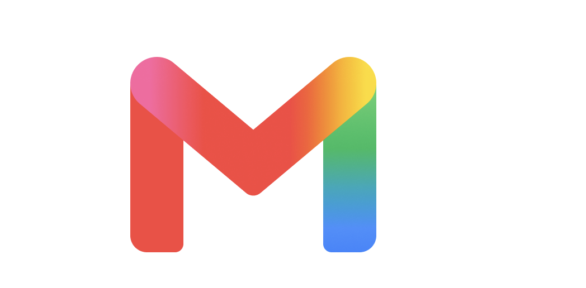

# Dashboard WASH Cluster State of Palestine — capture 2026-05-21

**Source :** Power BI public du WASH Cluster State of Palestine
**Date de la capture :** 21 mai 2026
**Métadonnées :** strippées (`magick -strip`)

---

## Identification du document

**Titre exact :** *« WASH Cluster — State of Palestine — Number of people reached with appropriate drinking and domestic water services »*

Hébergé sur Microsoft Power BI public (consultable sans authentification). Liens trouvés via recherche web :

- https://app.powerbi.com/view?r=eyJrIjoiNDBjNmQwOTktNzFmOS00YWFkLThlYTItN2ExNWZmNzJhNTUyIiwidCI6Ijc3NDEwMTk1LTE0ZTEtNGZiOC05MDRiLWFiMTg5MjAyMzY2NyIsImMiOjh9
- https://app.powerbi.com/view?r=eyJrIjoiZTVkYmEwNmMtZWYxNy00ODhlLWI2ZjctNjIzMzQ5OGQxNzY5IiwidCI6IjI2MmY2YTQxLTIwZTktNDE0MC04ZDNlLWZkZjVlZWNiNDE1NyIsImMiOjl9

---

## Liste complète des partenaires visibles dans le filtre « Responsive Partners »

| Acronyme | Identification probable |
|---|---|
| CESVI | Cooperazione E Sviluppo (✓ liste 2022) |
| CMWU | Coastal Municipal Water Utility (autorité locale, ✓) |
| CRS | Catholic Relief Services (✓ 2022) |
| DCA/NCA | DanChurchAid/Norwegian Church Aid (✓ 2022) |
| DFD | non identifié |
| FAFD | non identifié |
| GDD | non identifié |
| GEM | non identifié |
| **HA** | **Human Appeal (✓ 2022)** — sélectionné dans la capture |
| HF | non identifié |
| IDRF | International Development and Relief Foundation (✓ 2022) |
| IHH | İnsani Yardım Vakfı (ONG turque, pas dans liste 2022 — entrée 2024-2025) |
| MSF-F | Médecins Sans Frontières — France (pas dans liste 2022) |
| MSF-OCB | MSF Operational Centre Brussels (pas dans liste 2022) |
| MSF-S | MSF — Espagne ou Suisse (pas dans liste 2022) |
| NPA | Norwegian People's Aid (pas dans liste 2022) |
| NRC | Norwegian Refugee Council (✓ 2022) |
| OCK3 | non identifié — voir analyse ci-dessous |
| Other | catégorie résiduelle |
| Oxfam | (✓ 2022) |
| PAEEP | non identifié |
| PALSTD | non identifié |
| PARC | Palestinian Agricultural Relief Committees (✓ 2022) |
| PCRF | Palestine Children's Relief Fund (pas dans 2022) |
| SHAMS-OCB | non identifié (probablement composé) |
| SI | Solidarités International (pas dans 2022) |
| SIF | Secours Islamique France (✓ 2022) |
| SOS | SOS Villages d'Enfants (pas dans 2022) |
| TDH | Terre des Hommes (pas dans 2022) |
| UAWC | Union of Agricultural Work Committees (✓ 2022) |
| UNDP | United Nations Development Programme (✓ 2022) |
| UNICEF | (✓ 2022, agence chef de file) |
| UNRWA | UN Relief and Works Agency (✓ 2022) |
| WCK | World Central Kitchen (pas dans 2022) |
| YDRO | non identifié |

→ **~36 partenaires visibles**, cohérent avec « 41 partenaires » indiqué dans la précédente version du dashboard (différentiel selon période).

---

## Sur OCK3 spécifiquement

Aucune correspondance trouvée dans les recherches web pour cet acronyme dans le contexte humanitaire Gaza. Hypothèses :
- Code interne du WASH Cluster pour une organisation locale palestinienne
- Acronyme tronqué ou opérationnel (ex : « OCK » + numéro de bureau)
- Organisation arabe dont l'acronyme transcrit donne OCK3

L'identification précise reste ouverte. Ce qui est certain : c'est un **partenaire référencé** du WASH Cluster, pas une organisation extérieure.

---

## Données quantitatives visibles dans la capture

### Carte « Reached people by governorate »
Échelle CapPeopleReached :
- 1 406 (minimum)
- 42 035
- 82 665
- 123 294
- 163 923 (maximum)

### Pie chart « Water quantity (m³) delivered by Governorate »

| Gouvernorat | Volume | Pourcentage |
|---|---|---|
| Khan Younis | 7,46 K m³ | 47,38 % |
| Middle Area | 3,93 K m³ | 24,97 % |
| Rafah | 2,65 K m³ | 16,84 % |
| Gaza | 1,69 K m³ | 10,76 % |
| **Total** | **~15,73 K m³** | 100 % |

⚠️ **Important** : la ventilation se fait **par gouvernorat**, **pas par partenaire**. Le dashboard ne publie pas un classement individuel par partenaire.

### Bénéficiaires directs touchés par mois (partiellement visible)
138 332 puis 115 566 (deux barres mensuelles)

---

## Ce que ce dashboard prouve

| Question | Réponse |
|---|---|
| Human Appeal est-elle dans la liste des partenaires actifs WASH Cluster en 2025-2026 ? | ✅ Oui (HA présent et sélectionnable) |
| OCK3 est-elle un partenaire WASH Cluster référencé ? | ✅ Oui (même filtre) |
| Le dashboard que Human Appeal a utilisé dans sa pub existe réellement ? | ✅ Très probable — la structure de la capture pub correspond à ce dashboard |
| Le dashboard publie un classement des partenaires par volume ? | ❌ **Non** — la ventilation est par gouvernorat |
| HA est-elle 2ᵉ ? | ❌ **Le dashboard ne le dit pas** |

---

## Ce que ça change pour l'enquête

- **Constat 5** (acronyme HA) : confirmé. HA = Human Appeal dans le registre du cluster.
- **Constat 4** (ranking #2) : **renforcé.** Même en accédant au véritable dashboard WASH Cluster, on ne trouve **pas** de classement par partenaire. La ventilation est géographique, pas par acteur. L'affirmation publicitaire « 2ᵉ » ne s'extrait pas naturellement de ce dashboard.

L'utilisateur du dashboard peut cliquer partenaire par partenaire pour voir les chiffres individuels, mais il faudrait alors faire la comparaison à la main sur 36+ partenaires. La cluster ne publie pas le résultat de cette comparaison. Human Appeal aurait pu la faire elle-même.

---

## Liens

- [Constat 4 : ranking #2 invérifiable](../constats/04-ranking-2eme-fournisseur.md)
- [Constat 5 : acronyme HA](../constats/05-acronyme-HA-dans-pub.md)
- [Source : Partners' Profile 2022](../sources/wash-cluster-partners-profile-2022.md)
